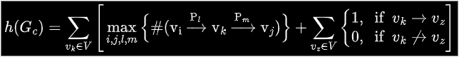

# University of Cincinnati Major Mapper / Degree Planner (aka "Can I Double Major?")

The end goal of this project is to have a (static) single page web application that will:

- Take in one or more majors/minors/certifications or other curriculums
- Display a "graph" of the curriculum(s) along with some statistics to aid in decision making for whether or not a student wishes to pursue a certain academic venture

## Setup

To work on or play around with this project locally:

1. Clone this repo
2. Make sure [nodejs](https://nodejs.org/en) is installed (`node --version` should be 22.X.X)
3. Run `npm install` to download dependencies
4. Run `npm run build` to compile this TypeScript project
5. Run `npm run start` to launch the web server on local host (port 8080)
6. Navigate to `localhost:8080` in any web browser (note: this project is being developed on Chrome, minor visual differences or issues may be present on other browsers)

*Note: Currently Computer Science (BSCS), Computer Engineering (BSCOMPE), and Electrical Engineering (BSEE) will be the only fields of study that work as I have to hard code them*

## How It Works

The following is a rough outline for how this app works conceptuality

1. The user answers a short questionnaire supplying various bits of information such as what field(s) of study they wish to pursue.
    - *Note: I hope to expand this questionnaire further, but those ideas are very theoretical at the moment*
2. The user will submit their answers to the web server, if the user has selected a single degree plan then steps 3 and 4 are skipped.
3. Otherwise, if the user selected more than one field of study, the program will merge the curricula into a single curriculum (ensuring that course dependencies are respected).
    - *Note: This merge step is not concerned with semester credit hours, only that class requisite chains are respected*
4. Once the curricula are merged, the program will then attempt to optimize the degree plan. This mainly consists of making sure that every semester is at or below 18 credit hours.
    - *Note: The optimize step may find it necessary to add additional semesters if there are simply too many credit hours floating around, however, this is a last resort*
5. After a final degree plan has been reached, the program will calculate metrics for each course. This metrics include Delay Factor (DF), Blocking Factor (BF), Centrality Factor (CF), and Structural Complexity (SC). While there are many papers out there discussing these metrics, my primary source for learning their algorithmic/mathematic definitions can be found [as part of the documentation for a related R package](https://cran.r-project.org/web/packages/CurricularAnalytics/vignettes/CurricularAnalytics.html). See the [metrics](#metrics) section for more details.

## Metrics

==Note: Much of this is either taken or adapted from the R package mentioned previously and is therefore only covering the basics==

All equations shown here assume that:

Any curriculum can be denoted as a DAG of verticies and edges such that

$$ G_{c} = (V, E) $$

$$ \text{Where each } v \in V = \{v_{1},...,v_n\} \text{ represents a course} $$

And edges can be represented as $(v_i, v_j) \in E$

Where course *i* must be completed prior to or in conjunction with course *j*

What follows is the definitions and short explanations for each metric that is being calculated per course.

**Delay Factor (DF):**

For a single node

<!-- Need to use a proper math code block here because GitHub can't render # otherwise for some reason -->
```math
DF(v_k) = \max_{i,j,l,m}\{\#(\ce{v_i->[P_l]v_k->[P_m]v_j})\}
```

For an entire curriculum graph

$$ DF(G_c) = \sum_{v_k\in{V}}DF(v_k) $$

**Blocking Factor (BF):**

For a single node

$$ BF(v_i)=\sum_{v_j\in{V}}{I(v_i,v_j)} $$

Where the indicator function `I` returns 1 if course *j* follows after course *i* and 0 otherwise

For an entire curriculum graph

$$ BF(G_c) = \sum_{v_k\in{V}}BF(v_k) $$

**Centrality Factor (CF):**

A course can be considered central based on the number of long paths that include it.

A long path is any path that satisfies the following:

- Nodes i, j, and k are all distinct
- Nodes j, i, and k can be shown to be in a single path
- Node j is a source node
- Node k is a sink node

Let $P_{v_i} = \{p_1,p_2,...\}$ denote the set of all paths defined as above
Then the centrality of a single node is given by

```math
CF(v_i) = \sum_{l=1}^{|P_{v_i}|}\#(p_l)
```

**Structural Complexity (SC):**

For a single node

$$ h(v_k) = DF(v_k) + BF(v_k) $$

**Other:**
Additionally, here are some basic extrapolations that can be made from the above equations:

Structural Complexity for an entire curriculum graph:


### Regards to old versions of this project

The original version of this project sought to scrape publicly available information from UC. This proved difficult to do with the inconsistencies between curriculums. Additionally, there was no feasible way to obtain information regarding prerequisite information (ie. there was no way for the program to tell that Calculus 1 is required to take Calculus 2) which is the ultimate reason I moved away from the approach altogether.
