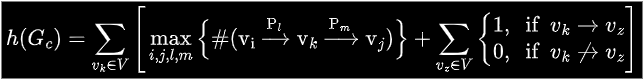

# University of Cincinnati Major Mapper / Degree Planner (aka "Can I Double Major?")

College planning can be a lot. Especially for incoming High School students with little to no reference for the world of higher education. This difficulty compounds if a student wishes to purse multiple fields of study.

This degree planner hopes to provide a web tool usable by current/incoming college students and college advisors to plan for 1 or more potential academic avenues. Using concepts from current discussions in academia surrounding the idea of "curricular analytics" to made informed decisions about course placement.

## Setup

To work on or play around with this project locally:

1. Clone this repo
2. Make sure [nodejs](https://nodejs.org/en) is installed (`node --version` should be 22.X.X)
3. Run `npm install` to download dependencies
4. Run `npm run build` to compile this TypeScript project
5. Run `npm run start` to launch the web server on local host (port 8080)
6. Navigate to `localhost:8080` in any web browser (note: this project is being developed on Chrome, minor visual differences or issues may be present on other browsers)

*Note: Currently Computer Science (BSCS), Computer Engineering (BSCOMPE), and Electrical Engineering (BSEE) will be the only fields of study that work as I have to hard code them*

## How It Works

The following is a rough outline for how this app works conceptuality

1. The user answers a short questionnaire supplying various bits of information such as what field(s) of study they wish to pursue.
    - *Note: I hope to expand this questionnaire further, but those ideas are very theoretical at the moment*
2. The user will submit their answers to the web server, if the user has selected a single degree plan then steps 3 and 4 are skipped.
3. If the user has selected more than one curriculum, the two are merged into a single list and sorted. This merge ensures that any requisite edges are conservered  while also removing courses that are duplicate across multiple curricula
4. The sorted list of courses is passed to the builder. This step starts with a blank curriculum and slots in courses 1 by 1 (starting with locked classes, then following the sort order). This makes sure (for the most part) that no single semester goes over 18 credits and any additional semesters are added if requried.
5.  Once a base degree is built, an optimizer takes the degree plan and makes sure that no single semester if over 18 credit hours
6. Then, a second optimizer tries to move courses in hopes of minimizing a certain scoring function (TODO: Add a section about the deterministic "EGA")
7. After a final degree plan has been reached, the program will calculate metrics for each course. This metrics include Delay Factor (DF), Blocking Factor (BF), Centrality Factor (CF), and Structural Complexity (SC). While there are many papers out there discussing these metrics, my primary source for learning their algorithmic/mathematic definitions can be found [as part of the documentation for a related R package](https://cran.r-project.org/web/packages/CurricularAnalytics/vignettes/CurricularAnalytics.html). See the [metrics](#metrics) section for more details.

## Metrics

Note: Much of this is either taken or adapted from the R package mentioned previously and is therefore only covering the basics

All equations shown here assume that:

Any curriculum can be denoted as a DAG of verticies and edges such that

$$ G_{c} = (V, E) $$

$$ \text{Where each } v \in V = \{v_{1},...,v_n\} \text{ represents a course} $$

And edges can be represented as $(v_i, v_j) \in E$

Where course *i* must be completed prior to or in conjunction with course *j*

What follows is the definitions and short explanations for each metric that is being calculated per course.

**Delay Factor (DF):**

For a single node

$$ DF(v_k) = \max_{i,j,l,m}\{(\\#(\ce{v_i->[P_l]v_k->[P_m]v_j}))\} $$

For an entire curriculum graph

$$ DF(G_c) = \sum_{v_k\in{V}}DF(v_k) $$

**Blocking Factor (BF):**

For a single node

$$ BF(v_i)=\sum_{v_j\in{V}}{I(v_i,v_j)} $$

Where the indicator function `I` returns 1 if course *j* follows after course *i* and 0 otherwise

For an entire curriculum graph

$$ BF(G_c) = \sum_{v_k\in{V}}BF(v_k) $$

**Centrality Factor (CF):**

A course can be considered central based on the number of long paths that include it.

A long path is any path that satisfies the following:

- Nodes i, j, and k are all distinct
- Nodes j, i, and k can be shown to be in a single path
- Node j is a source node
- Node k is a sink node

Let $P_{v_i} = \{p_1,p_2,...\}$ denote the set of all paths defined as above
Then the centrality of a single node is given by

```math
CF(v_i) = \sum_{l=1}^{|P_{v_i}|}\#(p_l)
```

**Structural Complexity (SC):**

For a single node

$$ h(v_k) = DF(v_k) + BF(v_k) $$

**Other:**

Additionally, here are some basic extrapolations that can be made from the above equations (more will be added in the future):

Structural Complexity for an entire curriculum graph:


## Semester Locking

In order to create more reasonable outputs, its important to restrict the movement of certain courses. Certainly, its unreasonable for a student to take their senior design courses their freshman year. This is where the idea of "semester locking" comes into play.

A course can have multiple semester locks depending on circumstances

There are two types of locks: *absolute* and *relative*

Absolute: a positive integer between 0 and (number of semesters - 1) that represents a hard, constant, lock to a semester

Relative: a negative integer where abs(lock) is between 1 and the number of semesters, representing a count backwards in the curriculum starting from the last semester (which is index -1)

This enables us to ensure that a student will meet certain timely course requirements such as senior design, professional development, or calculus.

**NOTE: not all courses need a semester lock, in fact very few will probably have them**
